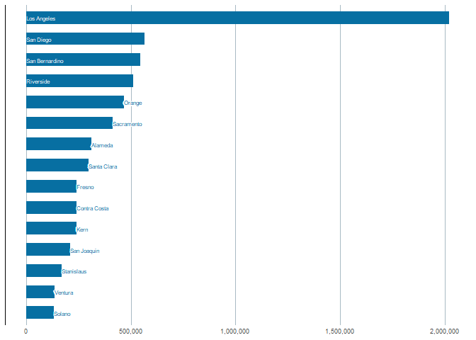
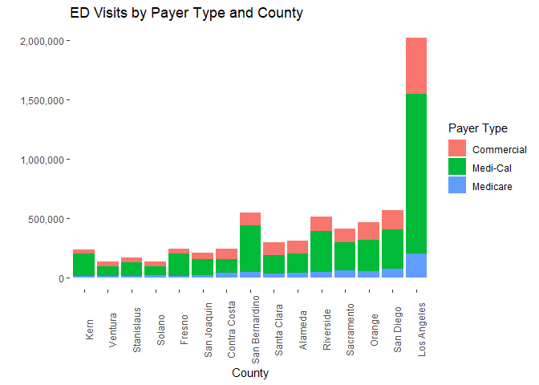

R Studio Payer Type Project
================

### About the datatset

This dataset was found in the website
<https://data.ca.gov/dataset/healthcare-payments-data-hpd-healthcare-measures>.
Created by the Department of Health Care Access and Information, this
dataset is about blah blah. The purpose of using this dataset was
because I was interested in seeing the relationship with diseases and
pay types. I wanted to investigate if there were descriptive differences
through the different payor type and the health diagnosis of the
patients. Specifically I wanted to demonstrate my capacity to use R to
manipulate the data, creating metrics such as weighted means to take
into account blah blah,

#### Joining Files

``` r
#Merging files
health_df <- health_data_df %>% 
  left_join(health_descrip, by = "measure_id")
```

#### How the joined dataframe looks for the first few rows

``` r
head(health_df)
```

    ## # A tibble: 6 × 16
    ##   reporting_year age_band assigned_sex_at_birth county_name
    ##            <dbl> <chr>    <chr>                 <chr>      
    ## 1           2018 0-17     Female                Alameda    
    ## 2           2018 0-17     Female                Alameda    
    ## 3           2018 0-17     Female                Alameda    
    ## 4           2018 0-17     Female                Alameda    
    ## 5           2018 0-17     Female                Alameda    
    ## 6           2018 0-17     Female                Alameda    
    ## # ℹ 12 more variables: covered_california_region <chr>, payer_type <chr>,
    ## #   measure_id <dbl>, measure_numerator <dbl>, measure_denominator <dbl>,
    ## #   measure_scaling_factor <dbl>, suppression_ind <chr>, measure_name <chr>,
    ## #   `Measure Category` <chr>, `Measure Description` <chr>,
    ## #   `Numerator Definition` <chr>, `Denominator Definition` <chr>

## Question 1: In the year 2021, which counties are among the top 15 which had the highest number of ED visit rates?

``` r
q1 <- health_df %>% 
  filter(reporting_year == "2021" & measure_name == "ED Visit Rate") %>% 
  group_by(county_name, measure_name) %>% 
  summarise(total_ED = as.integer(sum(measure_numerator, na.rm = TRUE))) %>% 
  arrange(desc(total_ED)) %>% 
  ungroup() %>% 
  filter(total_ED > 0) %>% 
  mutate(county_name = fct_reorder(.f = county_name, .x = total_ED)) %>% 
  head(15)
```

<!-- -->

### Question 1: Analysis

From the plot we can observe that the counties with the highest
Emergency Department visits, are all counties where there is the highest
population concentrations. This is expected with our results.

## Question 2: Out of those 15 county with the higest ED rates, what was the behavior of their payer type?

``` r
q2 <- health_df %>% 
  filter(reporting_year == "2021" & measure_name == "ED Visit Rate" & county_name %in% q1$county_name) %>% 
  group_by(county_name, payer_type) %>% 
  summarise(total_payer_type = as.integer(sum(measure_numerator, na.rm = TRUE))) %>% 
  arrange(desc(total_payer_type)) %>% 
  ungroup() %>% 
  mutate(county_name = fct_reorder(.f = county_name, .x = total_payer_type)) 
```

<!-- -->

### Question 2: Analysis

As we can see from the plots blah blah blah

## Question 3: In the year of 2021 what are the measures percentage?

``` r
q3 <- health_df %>% 
  filter(reporting_year == "2021" & !(measure_name %in% c("Average Age", "Medical Member Count", "Pharmacy Member Count", "Medi-Cal Enrollment Rate", "Commercial Enrollment Rate", "Medicare Enrollment Rate"))) %>% 
  group_by(measure_name) %>% 
  summarise(total_count = as.integer(sum(measure_numerator, na.rm = TRUE)),
            total_whole = as.integer(sum(measure_denominator, na.rm = TRUE)),
            percentage = round(total_count/total_whole, digits = 4) * 100,
            total_count = comma(total_count),
            total_whole = comma(total_whole))%>% 
  arrange(desc(percentage)) %>% 
  ungroup()
```

    ## # A tibble: 29 × 4
    ##    measure_name                               total_count total_whole percentage
    ##    <chr>                                      <chr>       <chr>            <dbl>
    ##  1 High Blood Pressure (Hypertension) Preval… 4,475,565   31,947,574       14.0 
    ##  2 High Cholesterol (Hyperlipidemia) Prevale… 4,089,177   31,947,574       12.8 
    ##  3 Anxiety Prevalence                         2,572,781   31,947,574        8.05
    ##  4 Depression, Bipolar, or Other Depressive … 2,537,011   31,947,574        7.94
    ##  5 Diabetes Prevalence                        2,431,897   31,947,574        7.61
    ##  6 Obesity Prevalence                         2,366,404   31,947,574        7.41
    ##  7 Rheumatoid Arthritis/Osteoarthritis Preva… 1,890,674   31,947,574        5.92
    ##  8 Asthma Prevalence                          1,359,819   31,947,574        4.26
    ##  9 Anemia Prevalence                          1,345,333   31,947,574        4.21
    ## 10 Chronic Kidney Disease Prevalence          1,040,959   31,947,574        3.26
    ## # ℹ 19 more rows

### Question 3: Analysis

The highest percentage of a disease is High Blood pressure at 14%.

## Question 4: Since the disease with the highest percentage is High blood Pressure, are the percentages across payer types behaving similar within each county?

### Standardizing percentages by using the standard deviation of the means from each payor type group

``` r
q4 <- health_df %>% 
  filter(reporting_year == "2021" & measure_name == "High Blood Pressure (Hypertension) Prevalence") %>% 
  group_by(county_name, measure_name, payer_type) %>% 
  summarise(total_count = as.integer(sum(measure_numerator, na.rm = TRUE)),
            total_whole = as.integer(sum(measure_denominator, na.rm = TRUE)),
            percentage = round(total_count/total_whole, digits = 4) * 100) %>% 
  group_by(payer_type) %>% 
  mutate(stand_percent = scale(percentage),
         stand_percent = round(stand_percent, digits = 2)) %>% 
  arrange(desc(percentage)) %>% 
  ungroup() %>% 
  select(-measure_name)
```

    ## # A tibble: 174 × 6
    ##    county_name payer_type total_count total_whole percentage stand_percent[,1]
    ##    <chr>       <chr>            <int>       <int>      <dbl>             <dbl>
    ##  1 Tulare      Medicare         12200       18498       66.0              1.25
    ##  2 Kings       Medicare          3014        4588       65.7              1.23
    ##  3 San Joaquin Medicare         29461       45357       65.0              1.18
    ##  4 Glenn       Medicare           196         307       63.8              1.1 
    ##  5 Madera      Medicare          5790        9240       62.7              1.02
    ##  6 Fresno      Medicare         28007       44860       62.4              1   
    ##  7 Lassen      Medicare           127         206       61.6              0.94
    ##  8 Imperial    Medicare          2295        3809       60.2              0.84
    ##  9 Sutter      Medicare          1244        2070       60.1              0.83
    ## 10 Solano      Medicare         25251       42227       59.8              0.81
    ## # ℹ 164 more rows

### Question 4: Analysis

For Example for LA just from the percentage it appears that Medicare has
the highest percentage of cases. But the sizes of each payer type are
different within each group, therefore we could be comparing apples to
oranges, to make sure we can compare them by standardizing, we can see
that the percentage of 42.81 for Medicare patients in LA is -0.410
standard deviations below the mean percentage, for the whole Medicare
group. The standardized percentage for Medicare being below the mean
implies that the Medicare payer type in LA has a lower prevalence of
High Blood Pressure compared to the average prevalence within the
Medicare group. From observation the standardized percentage for
Commercial is notably different. However, further analysis would be
required to quantify the true difference.

## Question 5: What is the overall burden percentage of High blood Pressure by population?

``` r
q5 <- q4 %>% 
  group_by(county_name) %>% 
  summarise(weighted_average = sum((percentage * total_whole), na.rm = TRUE)/sum(total_whole, na.rm = TRUE),
            weighted_average = round(weighted_average, digits = 2)) %>% 
  arrange(desc(weighted_average))
```

    ## # A tibble: 58 × 2
    ##    county_name weighted_average
    ##    <chr>                  <dbl>
    ##  1 Amador                  19.3
    ##  2 Tuolumne                18.5
    ##  3 Imperial                17.4
    ##  4 Modoc                   17.4
    ##  5 Calaveras               17.3
    ##  6 Lake                    17.3
    ##  7 Del Norte               17.0
    ##  8 Mariposa                16.6
    ##  9 Kings                   16.4
    ## 10 Lassen                  16.4
    ## # ℹ 48 more rows

### Question 5: Analysis

Using the weighted average this table shows how

## Question 6: In the year 2021 what was the count of individuals by payer type?

``` r
q6 <- health_df %>% 
  filter(reporting_year == "2021" & measure_name %in% c("Commercial Enrollment Rate","Medicare Enrollment Rate","Medi-Cal Enrollment Rate")) %>% 
  group_by(payer_type) %>%
  summarise(total_count = as.integer(sum(measure_numerator, na.rm = TRUE)),
            total_count = comma(round(total_count, digits = 2)))
```

    ## # A tibble: 3 × 2
    ##   payer_type total_count
    ##   <chr>      <chr>      
    ## 1 Commercial 14,743,491 
    ## 2 Medi-Cal   14,022,861 
    ## 3 Medicare   3,181,222

### Question 6: Analysis

The count of individuals per group was blah blah something analytically
